# Do demo iPads have a canonical owner?
03 June 2022

A few years ago, I ordered a 4th generation Apple iPad Air and the store I purchased it from accidentally sent me a demo unit.

It was a fully working iPad but it came preloaded with a number of dummy items such as a five calendars, a handful of documents and acres of photos.

You can see these in any store but generally, you never get a chance to spend any length of time with them so making the most of this opportunity, I took a full backup of the device before resetting it.

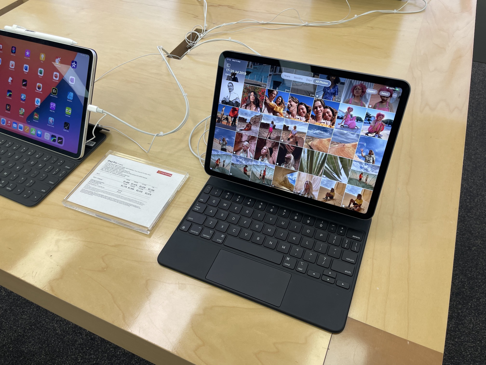

A few days later, the store got in contact with me and requested that I return it back to them since it wasn&#39;t meant to be dispatched. They didn&#39;t have any other units on hand so I ended up getting a refund instead.

Anyway, I figured it might be of some interest to someone so I [uploaded a copy of the demo materials to the Internet Archive](https://archive.org/details/i-pad-demo-backup) and never got around to doing anything more until now.

Something that I had wondered was if any of the content in the device was actually intertwined or if it was just a random helping of documents.

The short answer is that it is mostly just random items but each category of item tends to have been created from the point of view of a single person which is kind of neat.

I&#39;ll be doing a brief rundown of what I found and what I could infer from the demo content about each fictional person as best as I can.

Some of the data is meaningless outside of the demo unit such as Photos which were grouped such as two images that were under the &#34;Selfies&#34; category but I can&#39;t recreate that information with the photos themselves so this post can&#39;t be as extensive as it could have been but ah well, I mainly want to get this post off of my project backlog once and for all!

## Calendars

We&#39;ll start with the juiciest of all the categories first since the rest are fairly light on detail. We can infer quite a bit from the calendar from the various locations attached to events.

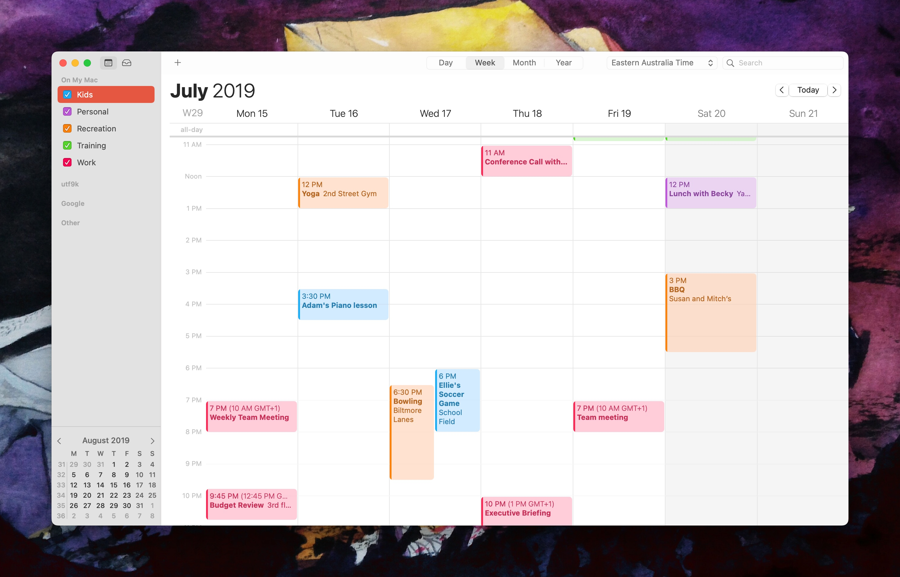

Loaded onto the demo unit were 5 calendars which are available as [ICS](https://en.wikipedia.org/wiki/ICalendar) exports for browsing with any Calendar client.

As far as I can tell, the calendar events consist entirely of recurring events which makes sense for a demo unit which may sit around for a number of years.

The five calendars available are called `Kids`, `Personal`, `Recreation`, `Training` and `Work`.

I&#39;ll mention in advance that a number of locations are mentioned in the calendar entries which are mostly real places around California so I dig into those a little bit.

We&#39;ll work through them in order:

### Kids

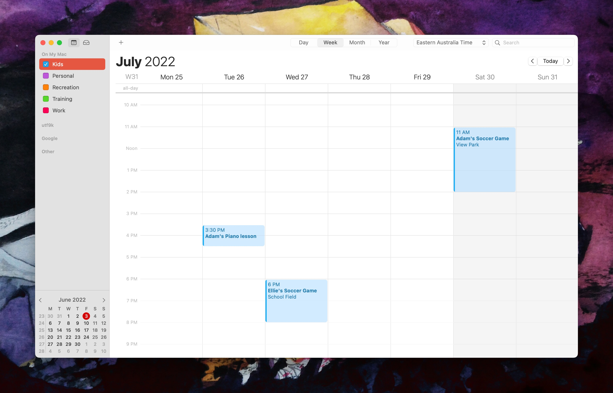

There are only 3 events on the kids calendar which are as follows:

* Adam&#39;s Piano lesson from 3:30pm - 4:30pm every Tuesday
* Ellie&#39;s Soccer Game from 6:00pm - 8:00pm every Wednesday
* Adam&#39;s Soccer Game from 11:00am - 2:00pm on every 5th Saturday

We can infer that this person has two kids: Adam and Ellie. Both play Soccer and Adam plays the piano.

The description for `Ellie&#39;s Soccer Game` mentioned `At Mount Tiburon High School - back field on the left.` in the description for the event but as far as I can tell, there isn&#39;t a Mount Tiburon High School.

[Tiburon](https://en.wikipedia.org/wiki/Tiburon,_California) is a real town in California that has a Mount Tiburon Road but no high school.

Interestingly, Tiburon is apparently home to [St. Hilary School](https://en.wikipedia.org/wiki/Tiburon,_California#Schools) which is an [Apple Distinguished School](https://www.apple.com/nz/education/k12/apple-distinguished-schools/) but it&#39;s probably a coincidence.

### Personal

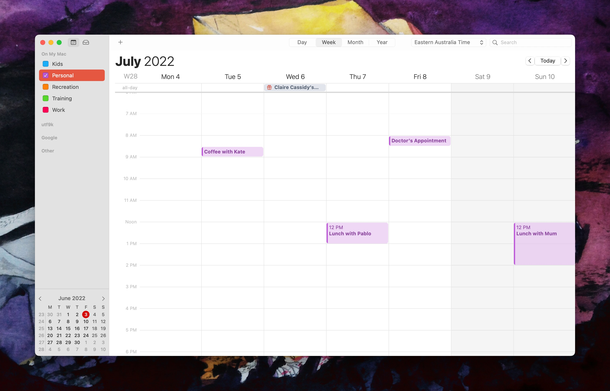

This calendar is home to a few generic events such as &#34;Pay Bills&#34; and &#34;Doctor&#39;s Appointment&#34;.

There are a number of lunch and coffee catchups and they tend to be at real places:

* Lunch with Pablo at [Michael Mina](https://www.michaelmina.net/restaurants/) every 2 weeks
* Lunch with Becky at [Yank Sing](https://yanksing.com/) every 7 weeks
* Lunch with Mum at [Bistro - South Park](https://hoodline.com/2017/09/french-bistro-south-park-cafe-to-bid-adieu/) every 4 weeks

There are some other catchups but none of them feature any locations

### Recreation

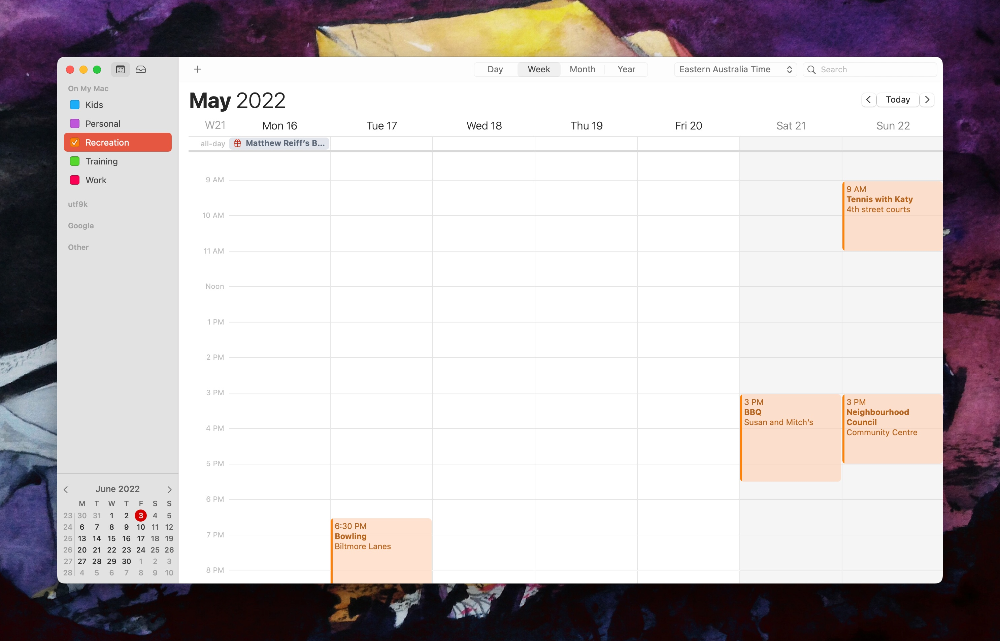

This calendar is what it says on the tin and features a number of locations as well:

* Lunch with Lucy at [Yank Sing](https://yanksing.com/) every 3 weeks
* Bowling at Biltmore Lanes every month.
  * I couldn&#39;t find any information on Biltmore Lanes if that&#39;s a real place.
* Neighbourhood Council at Community Centre on the 4th month of every Sunday
  * The community centre in question is not named but perhaps you could triangulate one by cross-referencing the locations the calendar owner visits?
* Yoga at [2nd Street Gym](https://2ndstreetgym.com/) every 3 weeks
* Brunch with Mindy at [Zazie](https://www.zaziesf.com/) on the 1st Sunday of every month
* Tennis with Katy at the 4th Street Courts every 3 weeks

### Training

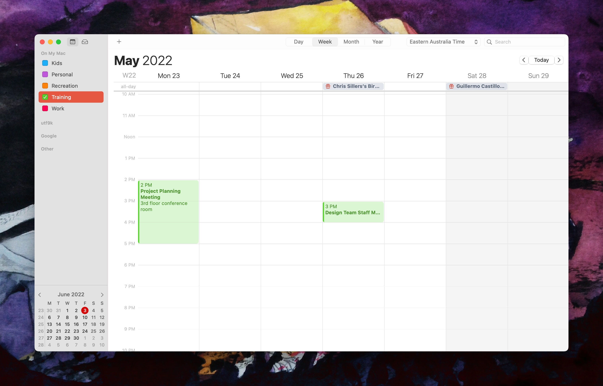

I expected this calendar to be full of gym sessions but instead it&#39;s a work calendar.

I&#39;m not sure who the training is in reference to, or if this calendar is even accurately named since it seems like a bunch of business meetings more than anything.

We&#39;ve got the following events:

* Design Team Staff Meeting: &#34;To review designs for this week&#39;s exec meetng and discuss remaining designs needed.&#34;
* Review Graphic Design
* Review Presentation with Susan
* Project Planning Meeting: &#34;To discuss project plan and review milestones and deliverables&#34;

None of this appears to be training unless it&#39;s training for design team members perhaps?

From this, we can infer that this person is perhaps some sort of product manager?

### Work

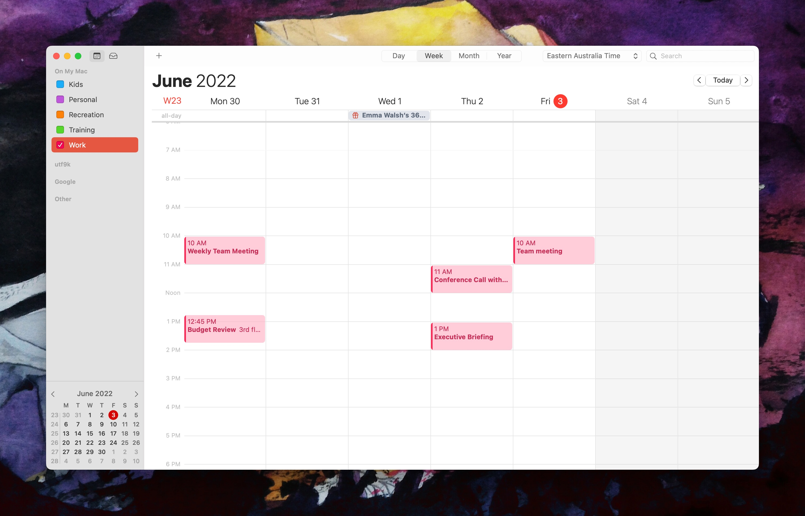

This is definitely the fullest calendar with a number of business meetings and catchups.

We&#39;ve got the following:

* Weekly Team Meeting: &#34;To discuss project status and deliverables. Please bring status on each deliverable due this week.&#34;
* Conference Call with Exec Team
* Budget Review: &#34;To review budget plans for upcoming projects&#34;
* Design Review
* Team meeting
* Contract Review with Allison
* Executive Briefing
* Expense Review: &#34;To review this expenses to date and discuss plans for the next phase of the project.&#34;
* Meeting with Sales Team

It&#39;s all very generic as to what this person&#39;s role is but of course, this is all stuff designed to be glanced at for a couple of seconds if at all.

There&#39;s also a monthly entry for &#34;Pancake Breakfast&#34; at &#34;St. Mary&#39;s&#34; but I couldn&#39;t find any such place in the [Bay Area](https://en.wikipedia.org/wiki/San_Francisco_Bay_Area).

## Contacts

There are 238 contact entries provided in two formats: [VCF](https://en.wikipedia.org/wiki/VCard) and [ABBU](https://fileinfo.com/extension/abbu)

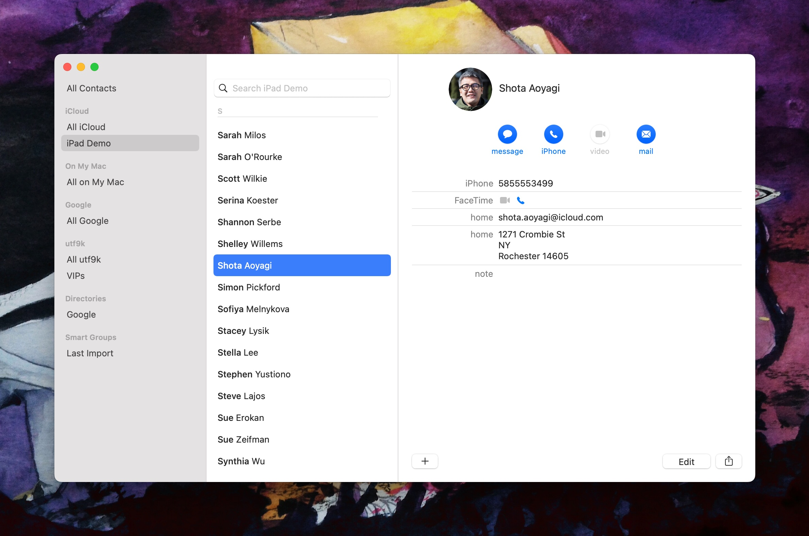

The vast majority of contacts have addressed all across the United States of America with a handful that have addresses in Australia.

Given I live in New Zealand, I&#39;m guessing that demo units have a handful of regionalised entries.

I couldn&#39;t determine any link between the contact entries and other categories ie; no one from the Contacts list appears in any of the Calendar entries or in the Summer Garden Party attendee list that we&#39;ll be covering later on.

That said, I did google a number of the names and they all appear to be Apple employees in some capacity but with stock avatars and made up contact details of course.

## Notes

These were loaded as [Apple Notes](https://en.wikipedia.org/wiki/Notes_(Apple)) but there&#39;s no standard format so they were all exported as PDFs. They&#39;re mostly intact but some formatting got mangled in the process.

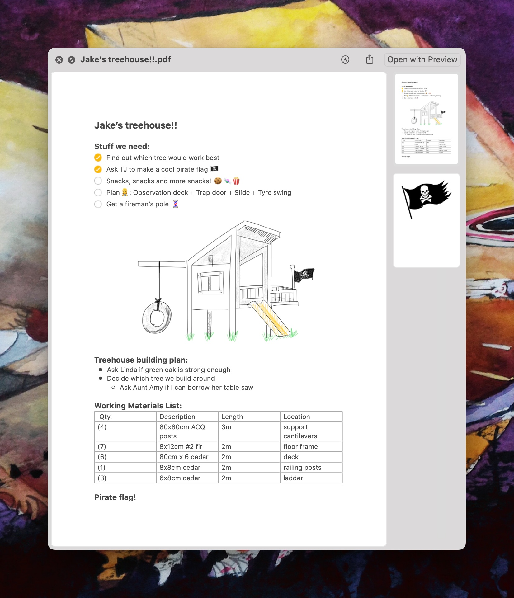

There&#39;s a note for `After-school activities for Jake` containing a checklist of sports so presumably this person is helping their son to decide on a sport. Interestingly, one of the entries is &#34;Footy&#34; which is a slang term for [Australian rules football](https://en.wikipedia.org/wiki/Australian_rules_football) so I guess this note is localised a little bit.

It seems this person is building a back porch based on the `Back porch dimensions` note with another title `Garden proposal from our architect` which details where to lay out plants around their &#34;back patio&#34;. I would note that porch isn&#39;t really a term used in [Oceania](https://en.wikipedia.org/wiki/Oceania).

Keeping with the renovation theme, we also have notes for `Trees/Plants for front garden`, `Things to do for salsa garden`, `New dishwasher options`, `Living room remodel ideas`, `Kitchen` (renovation) and `Get at hardware store`.

While I noted before about the mention of &#34;Footy&#34;, there are a few holiday planning notes that are all in America. The note `Ideas for US reunion w/ Dave and crew` has an entry for New York City that reads as follows:

&gt; We all met here and we all love this city, but maybe not the best choice for a week of catching up over old times.

The use of the term &#34;this&#34; implies that the person writing these notes currently lives in New York City but a few notes contradict this idea because they feature measurements in centimetres. America is one of the few countries that [doesn&#39;t make use of the metric system](https://en.wikipedia.org/wiki/United_States_customary_units) so this doesn&#39;t quite add up.

A few holiday notes seem to center around California which definitely lines up with the general Apple-adjacent locations that appear through the demo unit.

A note titled `Soccer practise times`[^1] contains practice times for Zoe and Ella who, in addition to Jake, are presumably the three children of the author of these notes.

The practice times mentioned take place at [Santa Rita School](https://www.santaritaschool.org/santaritaes/6993-Address-Directions.html), [Covington School](https://www.covingtonschool.org/ces/4740-About.html) and [Rosita Park](https://www.losaltosca.gov/recreation/page/rosita-park) which are all real places in [Los Altos, California](https://www.losaltosca.gov/).

If you check on a map, Los Altos is a short drive from Cupertino, which is home to [Apple&#39;s donut headquarters](https://en.wikipedia.org/wiki/Apple_Park).

Beyond the above, most of the notes don&#39;t really tell us much about the author besides the fact that they have three kids it appears.

## Numbers

There is a planning spreadsheet for a Summer Garden Party available as a [Numbers](https://en.wikipedia.org/wiki/Numbers_(spreadsheet)) file.

There isn&#39;t much to say about this other than it&#39;s a planning document for a party. I cross-referenced the names with the Contacts entries and while there were some shared names, I don&#39;t think they were the same people.

One thing I was able to infer was from a section on the &#34;Budget&#34; sheet titled &#34;Useful Contacts&#34;.

It lists a number of party-related businesses such as &#34;Joe the Juggler&#34; and &#34;True Cook&#34; catering. All of the phone numbers feature area codes from around the New York area.

## Pages

This is a document on the [Leaning Tower of Pisa](https://en.wikipedia.org/wiki/Leaning_Tower_of_Pisa) created with [Pages](https://en.wikipedia.org/wiki/Pages_(word_processor)). It&#39;s available as a `.pages` file as well as a PDF export.

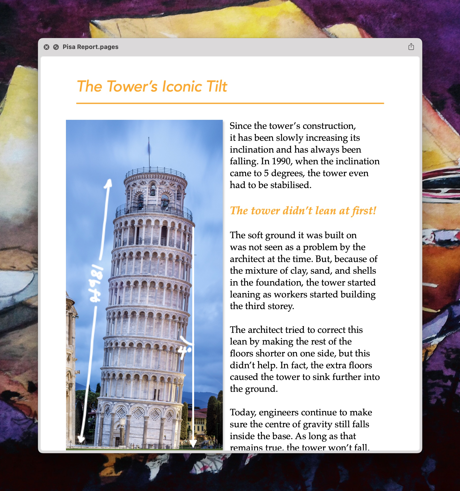

It appears to be a school report since it&#39;s relatively accessible and light on details. The cover page says that it&#39;s by &#34;Mariana Lin&#34;.

There is a &#34;Mariana Lin&#34; in the Contacts list but I can&#39;t say whether there&#39;s any relation since we know that the names features don&#39;t align with the contact details, being Apple employees.

## Slides

This is a presentation on [Yellowstone National Park](https://en.wikipedia.org/wiki/Yellowstone_National_Park) created with [Keynote](https://en.wikipedia.org/wiki/Keynote_(presentation_software)) and available as a `.key` file.

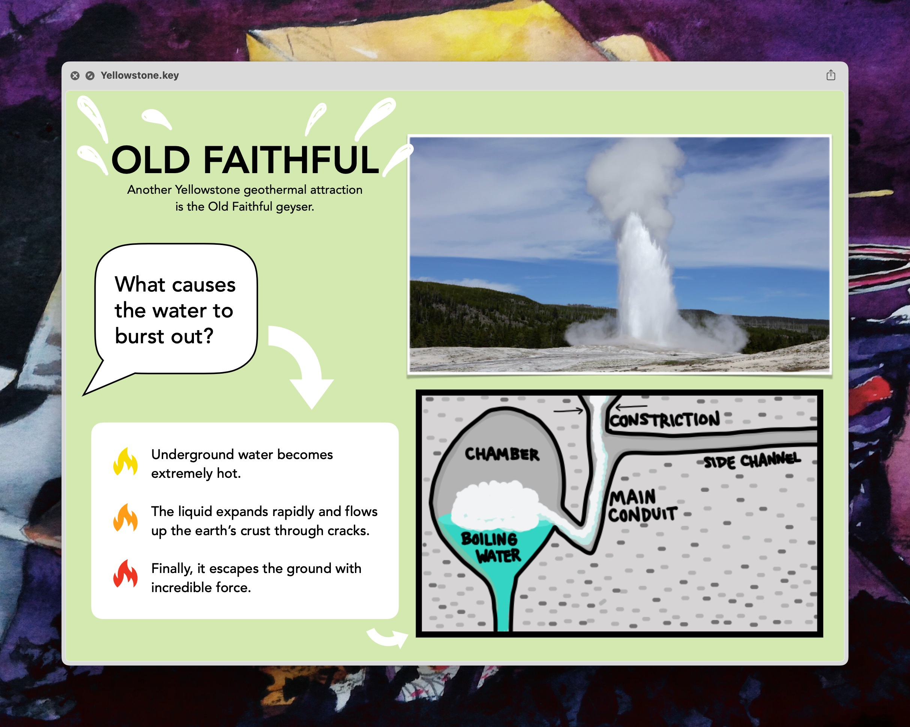

The presentation is attributed to Jamie Wong, Lauren Kerr and Greg Novick, none of whom appear in the Contacts listing.

I assume it&#39;s also meant to be a school presentation as it&#39;s pretty light on detail. I didn&#39;t check if there are any presenter notes but I&#39;m guessing there probably aren&#39;t.

Interestingly, running [`strings`](https://en.wikipedia.org/wiki/Strings_(Unix)) across the file throws up a reference to `Data/GettyImages-451901451-8851.mov` so it might include a video which would explain the beefy 236.5MB file size. I couldn&#39;t tell where it features from using Preview and I don&#39;t currently have Keynote installed.

## Maps

The installed version of Apple Maps contained 25 locations saved which were exported as a [webloc](https://fileinfo.com/extension/webloc) file that can be imported into Apple Maps.

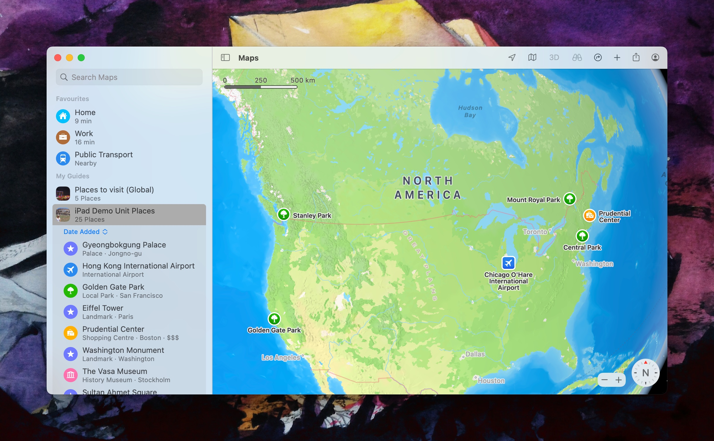

You can actually view all of the locations on the web [here](https://guides.apple.com/?ug=CglNeSBQbGFjZXMSDgiuTRCvqe7D1Ny%2B0c8BEg0Irk0Qz%2FvZ4ZWbx9tBEg4Irk0Q07KFg%2F%2FQ%2BrnQARIOCK5NEMeAvZu8zOeUtwESDQiuTRDI4rigp6nsmwoSDgiuTRDo%2Fqe%2FvObuqOkBEg0Irk0Q5K%2FmsO64yJlxEg0Irk0Q8ayI64Pohv4OEg0Irk0Q09rW7Kq%2BiJhkEg4Irk0Q4IWIktWzuN%2FrARIOCK5NEN%2FqnrONnc3%2FtQESDQiuTRDDnK%2Ffxefylm4SDgiuTRDO%2BLmCgoX4hIkBEg0Irk0QlqLPz%2B%2FCqu8kEg4Irk0Qxqnl%2FNTUhb3KARINCK5NEOjYh9WIyM7IQBINCK5NEMWgq%2BbIqN%2FzBBINCK5NELWBwaT3lZ7lFRINCK5NEOa0h4ye9qb3IhIOCK5NEL3vkc6h0JrS4wESDQiuTRCJidXtgZHQ4gQSDgiuTRCl45zH%2F5%2BYqfwBEg0Irk0Qs6KWyKqUs94NEg0Irk0Qy47O5vuQt5BgEg4Irk0Q8tnK55HulOvfARIOCK5NELKK3MOW3YeIhgE%3D) which is the link contained by the `webloc` file.

## Photos

As mentioned at the start, there are a great deal of photos but a lot of useful metadata requires them to be loaded into Photos.

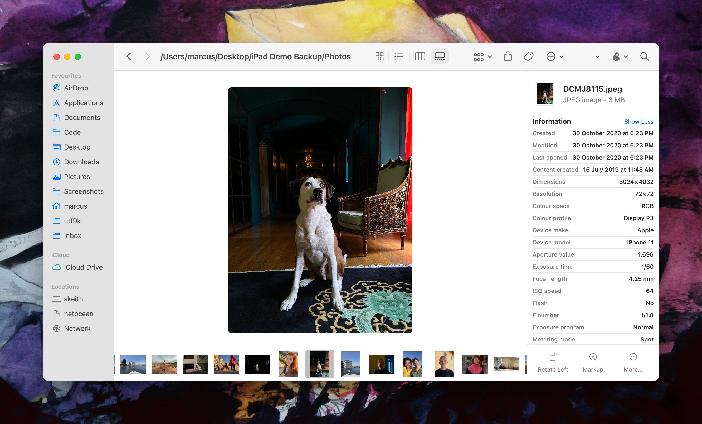

They all have their original metadata which is interesting since there are a range of iOS devices used to take photos, not that I could ever take photos that nice with my own phone.

There are 437 photos in total although upon a quick skim, there are actually a couple of [mov](https://en.wikipedia.org/wiki/QuickTime_File_Format) videos as well.

## Conclusion

Overall, this post wasn&#39;t particularly interesting to create but I figure it&#39;s useful to capture since the odds of getting a demo unit are probably not that great.

Each category of file tends to have been created from the point of view of a single person so it&#39;d be interesting to know how much detail went into determining each persona in order to inform what the content should look like.

I also wonder what team would be in charge of preloading fake content onto a device. I guess it would fall into the realm of marketing?

That&#39;d be kind funny telling your parents like &#34;Yeah, I make fake content for iPads&#34; or something.

Anyway, as mentioned, I&#39;m glad to finally cross this project off my list and delete these files from my desktop so they&#39;ll stop judging me.

Once again, you can download all of the files referenced in this post [over on the Internet Archive](https://archive.org/details/i-pad-demo-backup).

Enjoy!

[^1]: The typo is part of the title