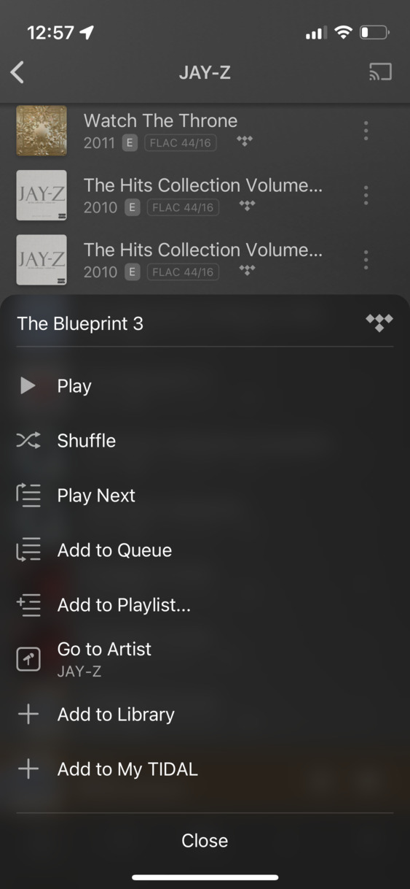
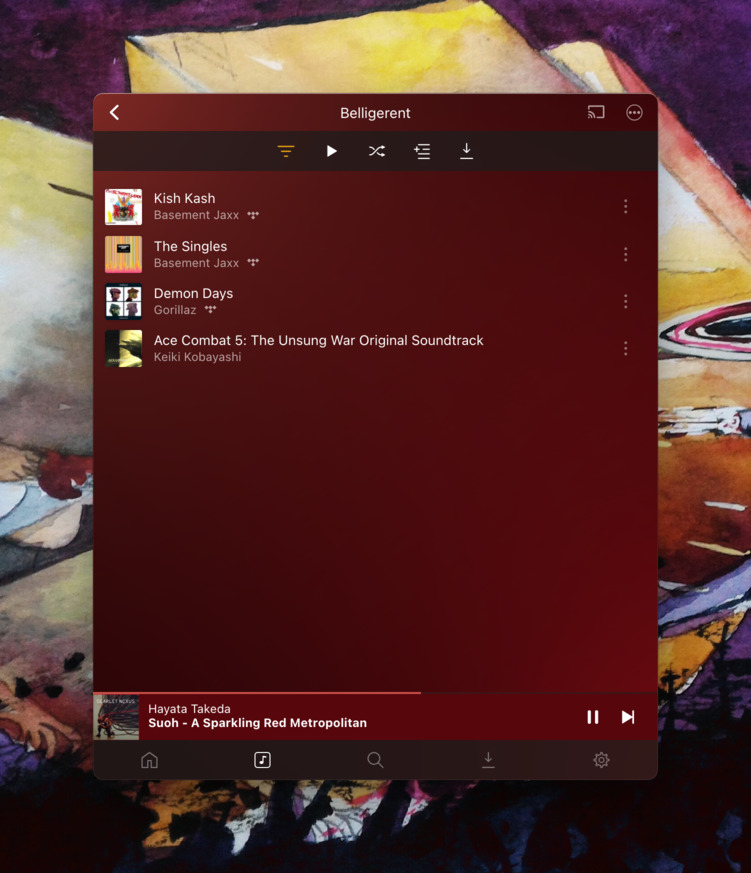
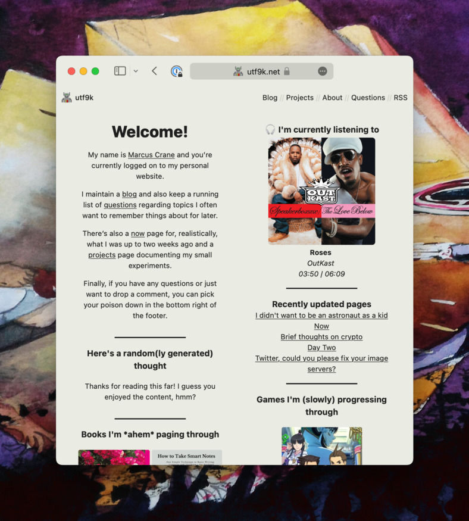
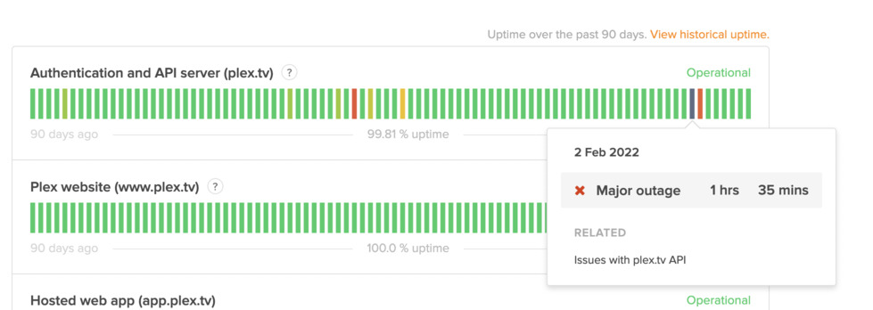
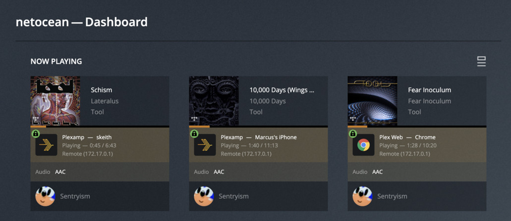
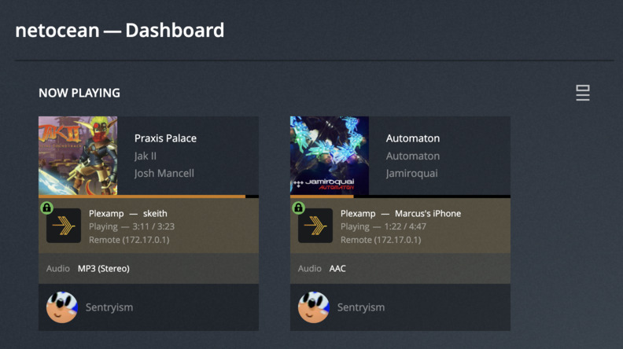
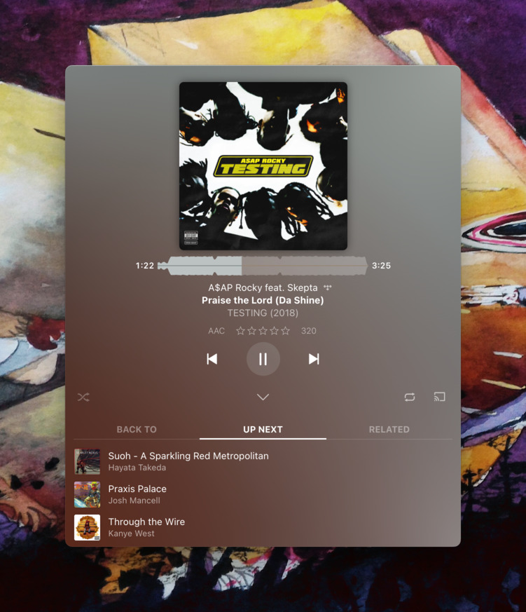

# Plex &#43; Tidal = A Nice Match
12 February 2022

{}
Due to the nature of this post, it&#39;s pretty image heavy.

Not all of the images are legible if you look at them inline so just a heads up that you can click on an image to view the full thing.
{}

As I&#39;m sure you&#39;re probably aware, Spotify has [had a bit of news coverage lately](https://www.npr.org/2022/01/31/1076891070/joe-rogan-responds-spotify-podcast-covid-misinformation) regarding [The Joe Rogan Experience](https://en.wikipedia.org/wiki/The_Joe_Rogan_Experience).

As a result, the band [Failure](https://en.wikipedia.org/wiki/Failure_(band)) announced[^pulling] that they are going to [pull their music from Spotify](https://www.nme.com/en_au/news/music/failure-remove-their-music-from-spotify-over-covid-controversy-enough-is-enough-3152537) in part because the [streaming payouts are supposed to be some of the worst in the industry](https://en.wikipedia.org/wiki/Criticism_of_Spotify#Allegations_of_unfair_artist_compensation).

I can&#39;t speak to any of the above with accuracy nor is this a post about the ethics of the streaming model for artists.

Instead, I&#39;m just a fan of Failure who figured they would take this opportunity to review other streaming services and see how they fare.

The goal here is to find a setup that lets me listen to everything I enjoy, with as little friction, while still supporting the artists I care about.

The solution I&#39;ve found that works for me, and that I&#39;ll be covering in this post, is to stream most things via [Plexamp](https://plexamp.com/).

It supports both streaming from [Tidal](https://tidal.com/) and playing content stored locally on my [Plex](https://www.plex.tv/) server, such as rips from games that never released official soundtracks.

For everything else, I can purchase albums from [Bandcamp](https://bandcamp.com), including content that was [never streamable](https://failureband.bandcamp.com/album/fantastic-planet-live) in the first place, plus I can feel better that I&#39;m better compensating the artists I enjoy.

From here, you can either save yourself a solid 15 - 20 minutes and close the tab or if you&#39;d like to read a deep dive into the bits and pieces that sold me on this setup, then I hope you enjoy what is now the longest post on this site to date 😮‍💨

## My history with Spotify

I&#39;ve had Spotify Premium for a number of years as part of an offer with my [telco](https://www.spark.co.nz/getmore/spotify/).

On their highest data plan, Spotify Premium is entirely free while lower plans give a partial subsidy[^subsidy] but I&#39;ve never actually used the Spotify Free tier in any meaningful capacity.[^cafe]

While I&#39;ve discovered a lot of new tracks over the years with Spotify, my general usage pattern is that I replay the last 10 - 20 songs on my Liked Songs playlist and occasionally I&#39;ll use the Song Radio feature on one of them.

This cycle repeats as I add more songs to Liked Songs and my &#34;play window&#34; slides up to include the new song and as a result, the last song dropped &#34;outside&#34; of the window.

Given my usage pattern, I&#39;m not hugely worried about giving up custom playlists[^discover] like &#34;Discover Weekly&#34; that I know a lot of people swear by. Worst case, I can still view them in the free version of Spotify if I decide to move on.

## My ideal criteria for a replacement

This post was never meant to be a comprehensive comparison of different services and what they offer but in saying that, it got a bit out of hand.

Spotify, [Apple Music](https://music.apple.com/) and [Tidal](https://tidal.com) were the three main contenders that I compared based on the (arguably niche) criteria I care about.

Let&#39;s break down of those bits of criteria and how each service matches up against them, at least in my experience.

### A good API

For anyone who has seen the little &#34;Now Playing&#34; widget on the front page of my site[^nowplaying], it was [powered by the Spotify API](https://github.com/marcus-crane/gunslinger/blob/db5337d6e6846d3555540abaafb0bcba775c3cf2/jobs/spotify.go#L61) by polling every few seconds for what I&#39;m currently listening to. I&#39;d definitely want to recreate that functionality if I can.

As far as I know, Spotify has the [most comprehensive API](https://developer.spotify.com/documentation/web-api/reference/#/) of any streaming platform, even exposing the ability to control playback programatically which could make for some really cool projects.

#### Apple Music

Apple Music is mostly ruled out here given their [API](https://developer.apple.com/documentation/applemusicapi/) is pretty lacking in general, especially when it comes to interacting with the current user.

I dunno what it is about Apple but reading their API documentation makes me feel like I&#39;ve been teleported back to 2006 with a bucket full of XML.

Maybe it&#39;s just a cultural artefact from when they only dealt with desktop applications because all of their web offerings feel extremely bizarre.

#### Tidal

Tidal is also out as they [don&#39;t even have a public API at all](https://twitter.com/TIDAL/status/699726946817679360).

There are a couple of unofficial API clients on Github but some of them haven&#39;t seen much activity in recent times.

I did consider trying to hack something together myself but that&#39;ll be addressed in the next section.

### Cross-platform sessions

This is something that Spotify really excels at.

If you play a song on mobile, you can continue it on your desktop and vice versa. By that, I mean you could either transfer the track to your desktop, picking up exactly where you left off, or you could continue on mobile while controlling the session from your desktop (ie; changing volume, pausing, switching song).


This was really handy at my previous job where trying to stream over a VPN[^vpn] was just asking for trouble.

Other times, I might be in the middle of a long podcast on mobile and I can&#39;t be bothered transferring as I sit down at my desktop.

#### Apple Music

This... sort of works on a technical level but still not really. I was disappointed here given that Apple generally has a decent track record when it comes to devices talking with each other.


As you can see, Apple Music on my laptop is aware that I&#39;m playing a song on an [HomePod](https://www.apple.com/nz/homepod-mini/). I can then select the HomePod and pause the track which then reflects instantly on my phone as well.

So basically, you can have sessions but only when the playing device is not an Apple Music client itself.

I also ran into this fun popup when poking around and this won&#39;t be the last time we see something like it in this post


#### Tidal

While looking into whether I could pull session information out of Tidal, I realised that it doesn&#39;t really have a concept of a current session. For example, if I play a song in the Tidal iOS app, the Tidal desktop client has no idea about any other clients. This doesn&#39;t reflect in the API either, at least from the calls I could see it making.

### Artists I like

This basically boils down to Failure who I previously mentioned and [Ed Harrison](https://edharrison.bandcamp.com/) given I listen to the Neotokyo OST a lot. Apparently Ed was my #1 artist in 2020 (according to Spotify Wrapped) with just over 2000 minutes (33.3 hours) which is... pretty bad.

### Apple Music

It has both Failure and Ed Harrison&#39;s catalogue. I&#39;m happy.

### Tidal

It has Failure and some of Ed Harrison&#39;s catalogue but not NeoTokyo. Honestly, this was a bit of a death blow for me as far as using Tidal by itself.

Tidal did have Jay-Z content as an exclusive in the past, which also included the Jay x Kanye West crossover album [Watch the Throne](https://en.wikipedia.org/wiki/Watch_the_Throne) which I like a lot. This is no longer the case as Jigga released his catalogue on Spotify to [celebrate his 50th birthday](https://twitter.com/Spotify/status/1202090253839937536).

Also, as I write this, I&#39;m now learning that [Hov sold the majority of his shares to &lt;strike&gt;Square&lt;/strike&gt; Block](https://www.vox.com/recode/22313268/tidal-square-jay-z-jack-dorsey-nft-explainer) in 2021? What the fuck?

{{&lt; tweet &#34;jack&#34; 1367460921937817602 &gt;}}

Jack Dorsey mentioned his vision for the future of Tidal:

&gt; We’ll work on entirely new listening experiences to bring fans closer together, simple integrations for merch sales, modern collaboration tools, and new complementary revenue streams.

That basically means nothing to me but whatever. The Carter Administration is still on the board of &lt;strike&gt;Square&lt;/strike&gt; Block and that can only mean one thing.


Beautiful.

## An annoying compromise

At this point, neither Tidal or Apple Music are hugely appealing based on the features I&#39;ve mentioned so far.

They&#39;re perfectly fine as streaming services but there&#39;s another aspect I haven&#39;t mentioned up to this point: Music stored on my Plex server.

I have a few rips[^khinsider] from various videogames that [don&#39;t have official albums](https://www.youtube.com/watch?v=e7Zn5I1xutE) that I&#39;ve kept floating around my Plex server for a few years now.

I aspire to listen to them more but I never get around to listening to them with Spotify as my daily driver as it doesn&#39;t support local files in any useful way[^localfiles]. It would be nice if there was a way to have both things in the same place.

My plan at this point was going to be trying out Tidal since it had a relatively nice UI. To get around the lack of Neotokyo, I could just purchase Ed&#39;s work from [Bandcamp](https://bandcamp.com) and load it onto Plex and just deal with the UX hassle of constantly switching between apps.

## The perfect candidate appears

I had been vaguely aware for a while that Plex touted some sort of integration with Tidal but I had no idea what form it took.

I had even read up on integration, where the killer feature is [clearly outlined](https://support.plex.tv/articles/add-tidal-content-to-your-plex-music-library/) but apparently I did a rubbish job at reading since I entirely overlooked it.



You&#39;ll see that there are two buttons at the bottom of the screen: *Add to My TIDAL* and *Add to Library*.

When I first hooked up Tidal to Plex, I would just press *Add to My TIDAL*.

Ok, great, it adds albums to my TIDAL library remote through Plex. Big whoop. A few days later, I accidentally hit *Add to Library* and oh my god.


You&#39;re telling me I can put Jay right next to Jak? Wrap it up, I think we&#39;ve got a winner on our hands! At this point, I was sold.

The ability to add virtual streaming items right next to my &#34;local&#34; (streaming from across the living room) items is pretty much the ideal outcome.

In fairness, Google Play Music offered something like this in the past but the idea of investing effort into a Google product is about as attractive as [preordering a coffin](https://music.youtube.com/googleplaymusic).

Anyway, with this, we can tick one piece of criteria off the list:

✅ for **Artists I like** (1/3)

## A quick note on Plexamp

Before we continue, I should note that I mostly interface with my Plex library (and Tidal) through [Plexamp](https://plexamp.com/).

For an audio player that [started life back in 2017](https://medium.com/plexlabs/introducing-plexamp-9493a658847a) as a [Plex Labs](https://medium.com/plexlabs) experiment, it has grown into an entire ecosystem, complete with mobile and desktop apps.

To be clear, it&#39;s just streaming content from your plex server through a music-focused client. It doesn&#39;t require deploying any additional software. You can also listen to Podcasts (via Plex) on it too although I don&#39;t do that myself.

The Tidal integration works perfectly fine with the regular Plex apps as well but the music section in general shines brightest when using Plexamp if you ask me.

## Ok but how well does it actually integrate with Tidal

At this point in our tour, you might be thinking &#34;Ok, sure but I bet under the hood, it&#39;s just duct tape and chewing gum&#34; which is definitely what I expected going in.

Thankfully, it really is a first class Plex citizen and I&#39;ll even give you a whirlwind tour of my favourite features.

### Cross-platform search

Whether finding something new or something existing, you can search across your entire catalog and Tidal&#39;s at the same time which is really appreciated.


### A lively home screen

The home screen is a great example of how Tidal content is interweaved with your local content pretty seamlessly.

The only thing that differentiates the two is a little logo tucked away next to the last played indicator.


There&#39;s much more that isn&#39;t illustrated here too. My library is still pretty empty (relatively speaking) but Plexamp will generate mixes for you like this:


To enable automatic mixes, and other features, you&#39;ll want to enable [Sonic Analysis](https://support.plex.tv/articles/sonic-analysis-music/). I did a bit of a facepalm when I realised I didn&#39;t have this enabled yet. I even read the blog post for it when it launched!

There&#39;s also a feature for surfacing what happened &#34;On This Day&#34; in music history:


It would have said that February 10th[^feb] is the 28th anniversary of [The College Dropout](https://en.wikipedia.org/wiki/The_College_Dropout) if not for a [pesky oversight](https://twitter.com/plexamp/status/1491497134851428352). Thankfully it should be addressed soon so we can appropriately celebrate ye&#39;s 
29th debut next year.

### Viewing albums by mood

There are a couple of cool groups like this such as albums by record labels and so on but mood is one of the more interesting.



I haven&#39;t taken it for a spin just yet but based on the premise, I can see myself using this quite a bit. It also demonstrates yet again how nicely the two sources (local and tidal) can play together.

It&#39;s about time that we look at why they play nicely together so let&#39;s take a peek under the hood.

## How&#39;s the API though?

If you remember, something I wanted was to continue powering the &#34;Now playing&#34; widget on the front of my website.



✅ for **A good API** (2/3)

Initially playing Tidal content through the dedicated &#34;Music On TIDAL&#34; library[^source] didn&#39;t surface anything in the API but by virtue of adding items to our regular music library instead, we get full metadata available via the `/status/sessions` endpoint.

&lt;details&gt;&lt;summary&gt;Here&#39;s the absolute mountain of information available for you to play with&lt;/summary&gt;

```json
{
  &#34;MediaContainer&#34;: {
    &#34;size&#34;: 1,
    &#34;Metadata&#34;: [
      {
        &#34;addedAt&#34;: &#34;1064275200&#34;,
        &#34;allowSync&#34;: &#34;0&#34;,
        &#34;art&#34;: &#34;/library/metadata/9560/art/1644407944&#34;,
        &#34;attribution&#34;: &#34;com.tidal&#34;,
        &#34;duration&#34;: &#34;369573&#34;,
        &#34;grandparentArt&#34;: &#34;/library/metadata/9560/art/1644407944&#34;,
        &#34;grandparentGuid&#34;: &#34;plex://artist/5d07bbfc403c6402904a6105&#34;,
        &#34;grandparentKey&#34;: &#34;/library/metadata/9560&#34;,
        &#34;grandparentRatingKey&#34;: &#34;9560&#34;,
        &#34;grandparentThumb&#34;: &#34;/library/metadata/9560/thumb/1644407944&#34;,
        &#34;grandparentTitle&#34;: &#34;OutKast&#34;,
        &#34;guid&#34;: &#34;plex://track/5d07cebf403c6402900cd0d9&#34;,
        &#34;index&#34;: &#34;10&#34;,
        &#34;key&#34;: &#34;/library/metadata/9590&#34;,
        &#34;lastViewedAt&#34;: &#34;1644480645&#34;,
        &#34;librarySectionID&#34;: &#34;4&#34;,
        &#34;librarySectionKey&#34;: &#34;/library/sections/4&#34;,
        &#34;librarySectionTitle&#34;: &#34;Music&#34;,
        &#34;oneShot&#34;: &#34;1&#34;,
        &#34;originallyAvailableAt&#34;: &#34;2003-09-23&#34;,
        &#34;parentGuid&#34;: &#34;plex://album/5d07c173403c640290846b36&#34;,
        &#34;parentIndex&#34;: &#34;2&#34;,
        &#34;parentKey&#34;: &#34;/library/metadata/9561&#34;,
        &#34;parentRatingKey&#34;: &#34;9561&#34;,
        &#34;parentStudio&#34;: &#34;Arista&#34;,
        &#34;parentThumb&#34;: &#34;/library/metadata/9561/thumb/1644407962&#34;,
        &#34;parentTitle&#34;: &#34;Speakerboxxx / The Love Below&#34;,
        &#34;parentYear&#34;: &#34;2003&#34;,
        &#34;ratingKey&#34;: &#34;9590&#34;,
        &#34;remoteMedia&#34;: &#34;1&#34;,
        &#34;sessionKey&#34;: &#34;453&#34;,
        &#34;sourceKey&#34;: &#34;/library/metadata/5c038b3e48a2d2001de6a1a6&#34;,
        &#34;summary&#34;: &#34;&#34;,
        &#34;thumb&#34;: &#34;/library/metadata/9561/thumb/1644407962&#34;,
        &#34;title&#34;: &#34;Roses&#34;,
        &#34;type&#34;: &#34;track&#34;,
        &#34;updatedAt&#34;: &#34;1644407920&#34;,
        &#34;viewCount&#34;: &#34;1&#34;,
        &#34;viewOffset&#34;: &#34;258&#34;,
        &#34;Media&#34;: [
          {
            &#34;audioCodec&#34;: &#34;aac&#34;,
            &#34;container&#34;: &#34;mp4&#34;,
            &#34;duration&#34;: &#34;369000&#34;,
            &#34;id&#34;: &#34;12075&#34;,
            &#34;optimizedForStreaming&#34;: &#34;1&#34;,
            &#34;source&#34;: &#34;provider://tv.plex.provider.music&#34;,
            &#34;Part&#34;: [
              {
                &#34;container&#34;: &#34;mp4&#34;,
                &#34;duration&#34;: &#34;369000&#34;,
                &#34;id&#34;: &#34;12156&#34;,
                &#34;key&#34;: &#34;/library/parts/1772296-HIGH&#34;,
                &#34;Stream&#34;: [
                  {
                    &#34;albumGain&#34;: &#34;-9.71&#34;,
                    &#34;albumPeak&#34;: &#34;0.998444&#34;,
                    &#34;albumRange&#34;: &#34;10.019548&#34;,
                    &#34;bitrate&#34;: &#34;320&#34;,
                    &#34;codec&#34;: &#34;aac&#34;,
                    &#34;displayTitle&#34;: &#34;AAC&#34;,
                    &#34;duration&#34;: &#34;369000&#34;,
                    &#34;extendedDisplayTitle&#34;: &#34;AAC&#34;,
                    &#34;gain&#34;: &#34;-10.6&#34;,
                    &#34;id&#34;: &#34;25488&#34;,
                    &#34;index&#34;: &#34;0&#34;,
                    &#34;peak&#34;: &#34;0.988556&#34;,
                    &#34;selected&#34;: &#34;1&#34;,
                    &#34;streamType&#34;: &#34;2&#34;
                  },
                  {
                    &#34;codec&#34;: &#34;lrc&#34;,
                    &#34;displayTitle&#34;: &#34;LRC (External)&#34;,
                    &#34;extendedDisplayTitle&#34;: &#34;LRC (External)&#34;,
                    &#34;format&#34;: &#34;lrc&#34;,
                    &#34;id&#34;: &#34;26578&#34;,
                    &#34;key&#34;: &#34;/library/streams/26578&#34;,
                    &#34;minLines&#34;: &#34;3&#34;,
                    &#34;provider&#34;: &#34;com.plexapp.agents.lyricfind&#34;,
                    &#34;streamType&#34;: &#34;4&#34;,
                    &#34;timed&#34;: &#34;1&#34;
                  },
                  {
                    &#34;codec&#34;: &#34;txt&#34;,
                    &#34;displayTitle&#34;: &#34;TXT (External)&#34;,
                    &#34;extendedDisplayTitle&#34;: &#34;TXT (External)&#34;,
                    &#34;format&#34;: &#34;txt&#34;,
                    &#34;id&#34;: &#34;26579&#34;,
                    &#34;key&#34;: &#34;/library/streams/26579&#34;,
                    &#34;provider&#34;: &#34;com.plexapp.agents.lyricfind&#34;,
                    &#34;streamType&#34;: &#34;4&#34;
                  }
                ]
              }
            ]
          },
          {
            &#34;audioCodec&#34;: &#34;aac&#34;,
            &#34;container&#34;: &#34;mp4&#34;,
            &#34;duration&#34;: &#34;369000&#34;,
            &#34;id&#34;: &#34;12076&#34;,
            &#34;optimizedForStreaming&#34;: &#34;1&#34;,
            &#34;source&#34;: &#34;provider://tv.plex.provider.music&#34;,
            &#34;Part&#34;: [
              {
                &#34;container&#34;: &#34;mp4&#34;,
                &#34;duration&#34;: &#34;369000&#34;,
                &#34;id&#34;: &#34;12157&#34;,
                &#34;key&#34;: &#34;/library/parts/1772296-LOW&#34;,
                &#34;Stream&#34;: [
                  {
                    &#34;albumGain&#34;: &#34;-9.71&#34;,
                    &#34;albumPeak&#34;: &#34;0.998444&#34;,
                    &#34;albumRange&#34;: &#34;10.019548&#34;,
                    &#34;bitrate&#34;: &#34;96&#34;,
                    &#34;codec&#34;: &#34;aac&#34;,
                    &#34;displayTitle&#34;: &#34;AAC&#34;,
                    &#34;duration&#34;: &#34;369000&#34;,
                    &#34;extendedDisplayTitle&#34;: &#34;AAC&#34;,
                    &#34;gain&#34;: &#34;-10.6&#34;,
                    &#34;id&#34;: &#34;25489&#34;,
                    &#34;index&#34;: &#34;0&#34;,
                    &#34;peak&#34;: &#34;0.988556&#34;,
                    &#34;selected&#34;: &#34;1&#34;,
                    &#34;streamType&#34;: &#34;2&#34;
                  },
                  {
                    &#34;codec&#34;: &#34;lrc&#34;,
                    &#34;displayTitle&#34;: &#34;LRC (External)&#34;,
                    &#34;extendedDisplayTitle&#34;: &#34;LRC (External)&#34;,
                    &#34;format&#34;: &#34;lrc&#34;,
                    &#34;id&#34;: &#34;26580&#34;,
                    &#34;key&#34;: &#34;/library/streams/26580&#34;,
                    &#34;minLines&#34;: &#34;3&#34;,
                    &#34;provider&#34;: &#34;com.plexapp.agents.lyricfind&#34;,
                    &#34;streamType&#34;: &#34;4&#34;,
                    &#34;timed&#34;: &#34;1&#34;
                  },
                  {
                    &#34;codec&#34;: &#34;txt&#34;,
                    &#34;displayTitle&#34;: &#34;TXT (External)&#34;,
                    &#34;extendedDisplayTitle&#34;: &#34;TXT (External)&#34;,
                    &#34;format&#34;: &#34;txt&#34;,
                    &#34;id&#34;: &#34;26581&#34;,
                    &#34;key&#34;: &#34;/library/streams/26581&#34;,
                    &#34;provider&#34;: &#34;com.plexapp.agents.lyricfind&#34;,
                    &#34;streamType&#34;: &#34;4&#34;
                  }
                ]
              }
            ]
          }
        ],
        &#34;User&#34;: {
          &#34;id&#34;: &#34;1&#34;,
          &#34;thumb&#34;: &#34;https://plex.tv/users/&lt;me&gt;/avatar?c=1643535847&#34;,
          &#34;title&#34;: &#34;Sentryism&#34;
        },
        &#34;Player&#34;: {
          &#34;address&#34;: &#34;172.17.0.1&#34;,
          &#34;device&#34;: &#34;macOS&#34;,
          &#34;machineIdentifier&#34;: &#34;&lt;my machine&gt;&#34;,
          &#34;model&#34;: &#34;&#34;,
          &#34;platform&#34;: &#34;macOS&#34;,
          &#34;platformVersion&#34;: &#34;21.4.0&#34;,
          &#34;product&#34;: &#34;Plexamp&#34;,
          &#34;remotePublicAddress&#34;: &#34;172.17.0.1&#34;,
          &#34;state&#34;: &#34;playing&#34;,
          &#34;title&#34;: &#34;skeith&#34;,
          &#34;vendor&#34;: &#34;&#34;,
          &#34;version&#34;: &#34;3.9.1&#34;,
          &#34;local&#34;: false,
          &#34;relayed&#34;: false,
          &#34;secure&#34;: true,
          &#34;userID&#34;: 1
        }
      }
    ]
  }
}
```

&lt;/details&gt;

We can definitely work with that!

It is possible to have multiple sessions at once, and Plexamp often takes a while for sessions to terminate upon closing the app but I just sidestep that by filtering for any sessions that aren&#39;t paused. Don&#39;t worry, there&#39;ll be a section for gotchas like this later on.

I&#39;ll also put it into perspective that we&#39;re accessing metadata about a third party playing track, in a world that would love to choke you out with Widevine gloves on the mat. Relatively speaking, it&#39;s pretty refreshing to see.

As far as how this is possible, what&#39;s really going on here is that Plex&#39;s own metadata providers are doing the heavy lifting. When playing your local music, you get the exact same payload except for the `&#34;attribution&#34;: &#34;com.tidal&#34;` entry at the start.

## What about cross-platform sessions?

Kind of but not really?

At this point, I&#39;ll take 2 out of 3 happily but we&#39;re apparently getting something in this space very soon!

{{&lt; tweet &#34;plexamp&#34; &#34;1489024846033915908&#34; &gt;}}

❌ but 👀 for **Cross-platform sessions** (2/3)

**UPDATE**: For Valentines Day, we got [a lofty 4.0 update](https://forums.plex.tv/t/plexamp-release-notes/221280/38) which includes, among other things, the ability to control your playback on another device!


What you&#39;re seeing here is my phone controlling a session that&#39;s playing on my laptop.

Given this was part of a larger refactor that unlocked a lot of capabilities, I assume we&#39;ll see this fleshed out even more going forward.

I&#39;ll be updating this to:

✅ for **Cross-platform sessions** (3/3)

although my fingers are crossed that it gets to be even more seamless than it is in the first release!

## Ok but what&#39;s the catch here

In the spirit of fairness, nothing is perfect and there are few things I&#39;ve stumbled across while using this setup as my daily driver.

Most of these are either fine in moderation or things that I&#39;m sure the [Plexamp team](https://twitter.com/plexamp) are aiming to address. If not, the team can consider this post as my bug report/feature request list!

### Hard dependency on the authentication server

I had the misfortune of having this integration go down briefly due to an outage with the Plex authentication server.



As one might imagine, we&#39;re still at the mercy of (fairly invisible) DRM under the hood. No authentication server surely means no way to verify who has rights to play Tidal content.

{}
[Entropy](https://en.wikipedia.org/wiki/Entropy) is a sad fact of life and Plex&#39;s authentication servers are no different.

They&#39;re relatively stable but it&#39;s inevitable that the authentication server will fail again one day.

That isn&#39;t a slight towards Plex, it&#39;s just an unavoidable reality about computers.

Anyway, to work around this in future, you can [whitelist your local network](https://support.plex.tv/articles/200890058-authentication-for-local-network-access/) so that you can still stream (locally stored) content while you wait for the authentication server to return.
{}

While this sounds bad on paper, it&#39;s not really an issue in that nothing stops me just opening Tidal itself and streaming music from there in the meantime. If you remember, Plex has an &#34;Add to My Tidal&#34; button and this is where it can be useful as a backup.

As an [SRE](https://sre.google/), albeit one currently off the clock, if I&#39;m going to talk shit about availability then I should bring some data and so I did a brief skim of the [Plex status page](https://status.plex.tv/).

Basically, I added up the number of minutes elapsed for every publicly listed outage for the year of 2021 and got something just under 9 hours. That&#39;s almost bang on 99.9% (three nines) which is a pretty standard expectation for services.

Arguably you&#39;d hope for something closer to 99.99% (four nines) for a critical piece of infrastructure like that but eh, I&#39;m not exactly doing math out here.

Some of those incidents aren&#39;t even attributed to authentication outages but I threw them in there just to look at the worst case scenario.

These outages, when they do happen, are generally about an hour long. The odds of hitting the same hour period in the same month is [pretty slim... right?](https://rachelbythebay.com/w/2019/07/15/giant/). I&#39;ve used Plex for years prior to this and only run into them a couple of times although I will admit that music streaming is something that I do a lot more than visual media.

My personal opinion is that it&#39;s fine. I&#39;m not overly concerned! I have too many local tracks in my backlog to listen to so I&#39;ll just take it as an excuse to go through unplayed content instead of consuming the same 5 Outkast albums on a loop until I die.

Besides, every service has outages. This problem isn&#39;t unique to Plex.

### DRM...? Maybe yes, maybe no?

I stumbled onto this purely by accident but I guess you can&#39;t stream Tidal content if you access your Plex server via your local network (ie; instead of via https://app.plex.net)

Trying to do so gave me an error dialogue with this message:

&gt; An error occurred trying to play this item. Please make sure content from TIDAL is not already playing on another device.

Despite the message, nothing else was playing and despite my best effort, I couldn&#39;t get this to go away.

The exact same track would work via the hosted Plex app and I&#39;m not entirely sure.

I&#39;m guessing there is some arbitrary legalese in the deal between Tidal and Plex that says &#34;You must only load our content over an SSL connection&#34; or something to that effect.

It could also just be a bug 🤷‍♀️

Despite the error, it&#39;s perfectly possible to play multiple tracks from Tidal at the same time



If you&#39;re curious, here&#39;s how the aural mashup shown above sounded[^riaa]

&lt;center&gt;
  &lt;audio controls&gt;
    &lt;source src=&#34;tool-trio.mp3&#34; type=&#34;audio/mpeg&#34;&gt;
    Your browser doesn&#39;t support the audio tag :(
  &lt;/audio&gt;
&lt;/center&gt;

### You can&#39;t remove Tidal albums

This one seems like a weirdly obvious oversight so I&#39;m going to give the benefit of the doubt here and assume there was some weird technical limitation that mean this was deferred to the backlog.

The team are definitely aware of it:

{{&lt; tweet &#34;plexamp&#34; &#34;1491494752327372801&#34; &gt;}}

It&#39;s a little annoying though because I have added one or two albums accidentally and now they&#39;re just stuck with me forever but amongst an ocean of albums, it doesn&#39;t feel so bad.

### Plexamp sessions are weirdly long lived

Interestingly, Plexamp sessions can&#39;t be cancelled by the owner of a Plex server?

With most streaming content, you can force stop a session but here, you can&#39;t even kill your own sessions for some reason.



In this screenshot, I&#39;ve actually paused &#34;Praxis Palace&#34; but the media server continues to show it progressing as normal.

The green padlock indicates that I can&#39;t touch the session so I just sort of need to wait for it to expire on its own.

When the track reaches the end, the progress bar just jumps back to where I had gotten up to before closing the player.

My fingers are crossed that this will probably be handled by the refactor that gives us controllability between platforms.

## Closing thoughts

Believe or not, I actually cut this post short because I could gush about Plexamp for quite a while longer.

Suffice to say, I was sold from the minute I was able to weave Tidal tracks alongside my local tracks.



I&#39;ve been meaning to listen to a lot more game OSTs and while a heap were added to Spotify, there are still some really niche ones I kick myself for not getting around to.

The main thing that Plexamp offers me is the removal of friction between juggling multiple applications (in this case, Plex and Spotify) since the one I use heaviest will always dominate my focus.

With this setup, I don&#39;t have to worry about it because everything is in one place!

Usually that feels like a red flag but I think the integration has been handled really elegantly here. It&#39;s simply another provider for Plex with no more or less attention than every other provider. It just kinda works™.

I will reiterate though that if you don&#39;t care about local content, just use Spotify.

If you balk at the thought of paying for both Plex and Tidal, maybe this also isn&#39;t for you. Personally I&#39;ve subscribed to [Plex Pass](https://www.plex.tv/plex-pass/) so many years in a row that I ended up just investing in a lifetime subscription.

However, you like tinkering with APIs or you want to consolidate your library in one place, while not being enough of a masochist to build 100% of your library through local files, then maybe you&#39;ll enjoy this setup as much as I have.

Plexamp definitely feels like a labour of love and all of the little UI string gag planted throughout the app promote that feeling.

Perhaps the only question left now is whether I can bear to sully my library with [untaggable content](https://www.youtube.com/watch?v=kJunmC9YKQA).

Enjoy!

[^pulling]: It seems that these claims are starting to take effect. I didn&#39;t have any doubt but if I had to guess, I figure there&#39;s probably some process where Spotify waits out the calendar month in order to calculate compensation. It seems that Neil&#39;s entire catalogue has disappeared at the time of publishing. Prior to this, he pulled his catalogue [back in 2015](https://variety.com/2015/digital/news/two-weeks-later-neil-young-finally-removes-his-music-from-spotify-1201550338/) due to &#34;my music [being] devalued by the worst quality in the history of broadcasting or any other form of distribution&#34;

[^subsidy]: On lower plans, they usually pay for half and you just pay the remainder. It shows as an add-on to your mobile plan but it&#39;s a little more fiddly to setup than the higher data plan which just pays for the whole thing. If you use Spotify (as I did), it&#39;s easy to write off an upgrade to the highest plan as being the same plan &#43; a Spotify sub which you&#39;d have purchased anyway.

[^cafe]: Funnily enough, the first time I heard a Spotify ad was actually at a cafe that was using Spotify&#39;s free version. I&#39;m not entirely sure that&#39;s legal but damn, those ads really are annoying.

[^discover]: I know some people absolutely swear by Discover Weekly and while I think it is really good, I always forget to listen to it. I&#39;m also not opposed to just viewing it once a week and listening to those songs via an alternative streaming plans. Hell, I might just be able to pull the playlist via an API endpoint and populate an identical playlist somewhere else?

[^nowplaying]: Currently, it shows TV shows, movies and music via Plex and even what I&#39;m playing on my PS5 via the Playstation Network APIs. I&#39;ll probably write about it in a future blog post. It was previously powered by both Spotify and [Trakt](https://trakt.tv) before my switch though.

[^vpn]: Especially given all of the traffic would transit through Germany while I lived in New Zealand. It wasn&#39;t really the VPN though, more that the traffic passed through two or three different [NATs](https://en.wikipedia.org/wiki/Network_address_translation).

[^eardrums]: But for real though, nothing gets me in the mood to review software like having my eardrums blown out at 11:30pm while in bed :)

[^localfiles]: The feature has degraded over the years so I&#39;m not sure of the current state but last I checked, you can add local files to the desktop client. This doesn&#39;t actually sync them like a la Google Music but instead just dumps them all into a basic list that you can play. If you open Spotify on a different desktop, you have to do the same process again from scratch.

[^khinsider]: [*cough*](https://github.com/marcus-crane/khinsider)

[^feb]: The first draft of this post was written on Feb 10th but I didn&#39;t get around to editing it until Feb 12th hence this doesn&#39;t really line up with the publication date.

[^source]: There are two sources in Plex: One shows your Tidal library by itself and streams direct from Tidal. Given this, Tidal content doesn&#39;t show up in the API, as the stream doesn&#39;t transit via Plex. The other source is when you add Tidal content to your music library. This does transit via Plex so it shows up via the API.

[^riaa]: Do three audio fingerprints make a unique fingerprint? I hope the RIAA doesn&#39;t destroy my blog or I might have to use one of those shady Swiss bulletproof hosts going forward...
