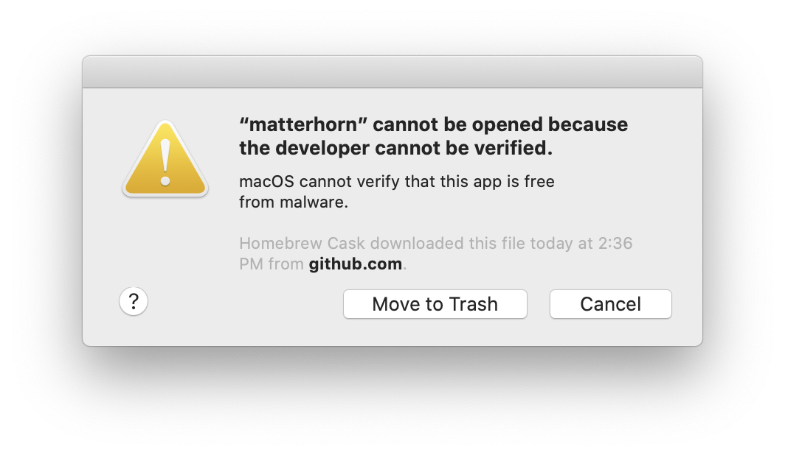

# How can I run a Homebrew application being blocked by Gatekeeper?
01 January 0001

This issue is particularly annoying and I only just discovered it today for the first time.

Here&#39;s an example of what it looks like



In order to install the application so that it bypasses Gatekeeper, you can rerun `brew cask install` like so:

```shell
&gt; brew cask install --no-quarantine blah
&gt; brew reinstall --no-quarantine blah
```

If you&#39;d like to keep this flag enabled all the time, and honestly you might as well, you can also do the following:

```shell
&gt; export HOMEBREW_CASK_OPTS=&#34;--no-quarantine&#34;
&gt; brew cask install blah
```