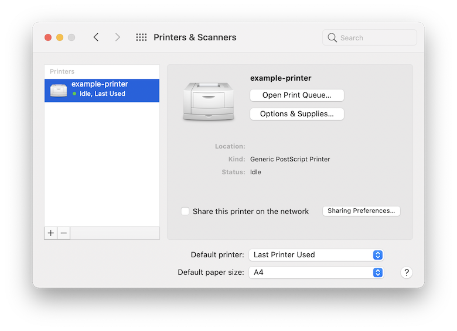

# How can I configure my printer via terminal on macOS?
01 January 0001

Recently, a coworker of mine got a new laptop and needed to connect to the printer at work. One of the dialog boxes asked for the &#34;print queue&#34;.

For the unfamiliar, here&#39;s what the macOS printer settings look like.



I can&#39;t see any queue settings so let&#39;s dive a little deeper.


Nothing here either but surely there must be something under the hood. Thankfully, there&#39;s a built in command called `lpstat` that allows all sorts of printer configuration.

```bash
&gt; man lpstat | grep lpstat
lpstat(1)                          Apple Inc.                          lpstat(1)
       lpstat - print cups status information
26 April 2019                         CUPS                             lpstat(1)
```

In order to find the printer queue name, I was able to make use of `lpstat -s` like so:

```bash
&gt; lpstat -s
system default destination: example_printer
device for example_printer: ipp://example-printer/my-fake-queue
```

Ah, so the queue name is `my-fake-queue`. I wish the System Preferences pane had just said so earlier.

While there, I also discovered a bunch of my old print jobs as well!

```bash
&gt; lpstat -W completed -l
example_printer-3 marcus          59392   Wed 28 Apr 09:40:30 2021
    Status: The printer is not responding.
    Alerts: processing-to-stop-point
    queued for example_printer
example_printer-2 marcus         113664   Wed 17 Mar 15:36:56 2021
    Status: The printer is unreachable at this time.
    Alerts: job-canceled-by-user
    queued for example_printer
example_printer-1 marcus          51200   Thu  8 Oct 11:14:01 2020
    Status:
    Alerts: processing-to-stop-point
    queued for example_printer
```

Hopefully this makes your printing life easier, or at least gives you some closure on why those months old jobs refused to print.