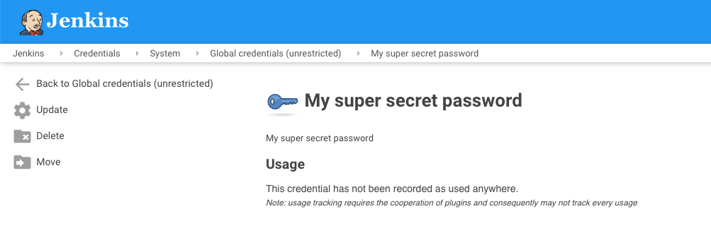
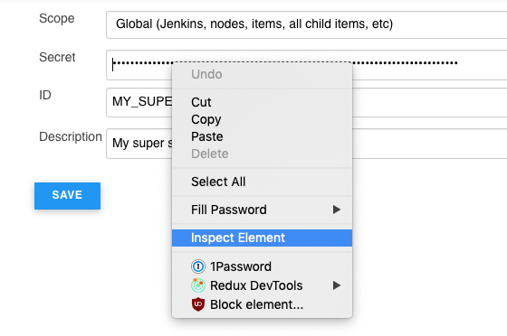
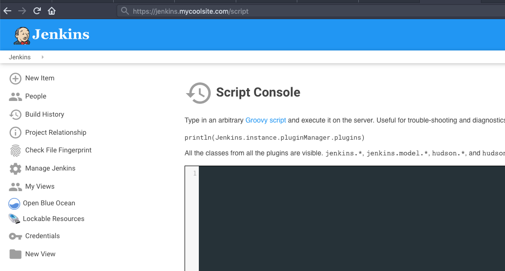

Have you ever stored a password in Jenkins, only to forget later on what the value is? You might try logging it from inside an existing job, but you'll find that Jenkins goes out of its way to mask that value from you (and any potential attackers!)

There's a sneaky way to get those credentials out of a Jenkins agent that requires only a little bit of wrangling. It may be possible to lock this down, I haven't looked, so it's good to be aware of it, in order to consider the security implications too.

Find the password you want to get your hands on

Click `Update` which will show you an obscured version of the secret

Right click on the `Secret` field and hit `Inspect Element` to bring up the developer tools for your browser

Either right click on the `value` part of the input field, or double click on the value area and copy the wonky looking hash. It'll be surrounded with braces eg; `{ABC123=}`

With that value in your clipboard, go to `/script` eg; `https://jenkins.example.com/script` or from the homepage, visit `Manage Jenkins -> Script Console`

Enter the following into the script console: `println(hudson.util.Secret.decrypt('<paste hash here>'))`. Make sure to include the braces and the single quotes. You should see your credential output as seen below

It's a pretty handy trick, but quite obviously a borderline exploit at the same time. It's up to you to use it responsibly!
