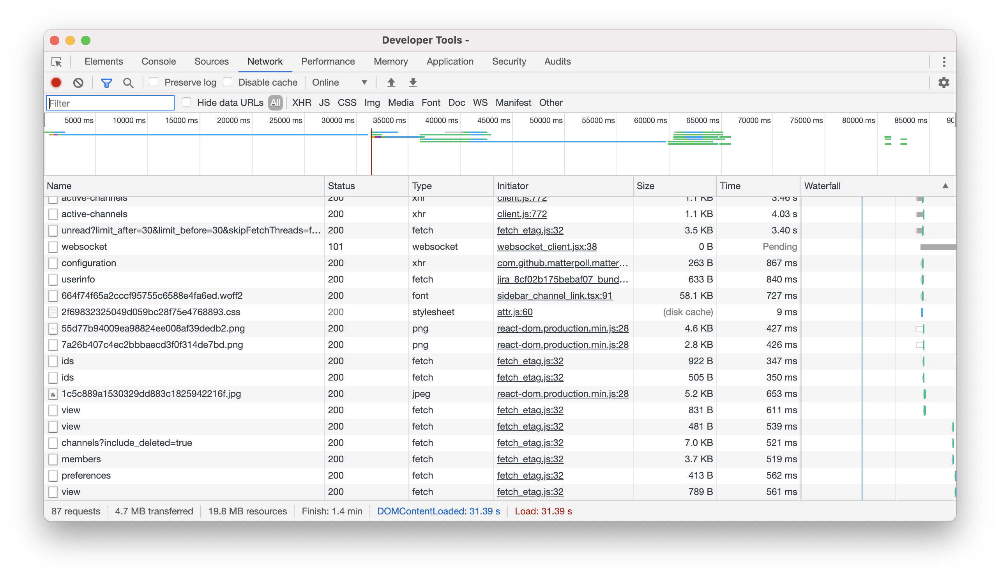

+++
title = "Latency as a forcing function"
date = "2021-01-29"
draft = true
slug = "latency-as-a-forcing-function"
+++

I'm probably not alone in admitting that sometimes *not* checking work apps can be pretty hard.

At my previous job, we used Slack and partly due to the cozy nature of some threads, I'd often find myself opening it without noticing.

I've witnessed colleagues do this too, often at social events, where they suddenly snap back to reality and realise "Wait, what the hell am I doing?"

Not Slack isn't the super snappiest application but compared to one of the current chat mediums at my workplace, it may as well be a bullet train in terms of latency.

I'll give you a glimpse into what you could be enjoying.

## The perils of Javascript

While Mattermost is primarily a web based chat application, I tend to use the desktop client which isn't much more than an electron wrapper around the very same website so the experience is mostly the same.

The server is hosted on premises, for data sovereignty reasons, which means that all of the data is loaded direct from Germany with no CDNs in the middle for the very same reasons.

That in itself I don't have any trouble with but gosh, can it be slow!

Here's what I usually end up staring at a number of times

As a user, I would hope for at least a loading spinner but that spinner is contained in the Javascript bundle which... the server is sometimes too flaky to serve it seems.

Anyway, when this happens, I usually read for the View menu and click the following

The previously mentioned flakiness still causes troubles from time to time so it takes a couple of tries. I often click the "Developer Tools for Current Server" option seen above to see what exactly is happening under the hood.

Here's what a dead request usually gives me, and is generally the cause of the blank frame you saw earlier

After a few retries, we're able to fully load the application but only after an entire minute has passed!

Arguably, it gets even worse once we dig into some of the culprits. Here is one which is a Mattermost plugin called [Standup Raven](https://integrations.mattermost.com/standup-raven/).

A whopping 1/3 of the download time appears to be used up for a single plugin! To make matters worse, this plugins appear to be parsed first before any of the actual chat content is fetched so the Mattermost window sits unusable until all plugins are downloaded and loaded before progressing to fetch messages and channels.

According to the network request, the bundle is *a whopping 1.8MB* and that's after being gzipped. That's bigger than the actual client bundle itself!

My browser reported that the plugin was 7MB uncompressed so concerned that I was horribly misinterpreting this information, I looked up the [Github repository](https://github.com/standup-raven/standup-raven) for Standup Raven and took a look at the latest release which is [v3.2.0](https://github.com/standup-raven/standup-raven/releases/tag/v3.2.0).

Sure enough, the plugin on offer was distributed as part of an 11.1MB `tar.gz` archive and the bundle itself weighs in at `7.4MB`.

## What's the forcing function here?

Given how flaky the Mattermost client can often be, I actually stopped using it for the most part.

I checked it maybe one or twice a day but for the most part, I don't want anything to do with it and honestly, this has been great for my work life balance!

Well, not to say that I have any work life balance but at no point do I "fear" missing out because

a) The experience is unmanagable to the point where I don't want to be involved

and

b) My other non-European colleagues tend to have the same troubles

Now these might seem negative but funnily enough, it has actually delivered some pretty solid value as a quirk.

Given how much latency is sometimes involved, with messages taking a couple of seconds to send at times, the amount of traffic is often quite slow.

There's no constant stream of discussion and emojis flooding into my laptop over websockets. It's pure quiet bliss.

A large part of that is due to timezones mind you but that only adds to the asychronous nature of Mattermost within our team.

It feels more akin to a notice board or an old school forum where you can back and check your thread the next day and despite your first thoughts, it doesn't really have any effect on efficiency that I've noticed.

If anything, I spend much less time checking Mattermost than I used to pouring over Slack due to FoMo or whatever.

If it's urgent, you can always page me!

## Could you fix this?

Admittedly, I did contact the administrators of our Mattermost instance but I think they're non technical?

The response I got was akin to "It works on my machine. Have you tried Google Chrome?"

After a bit of fiddling, I realised that simply adding the plugin configuration API endpoint to the ruleset for [uBlock Origin](https://chrome.google.com/webstore/detail/ublock-origin/cjpalhdlnbpafiamejdnhcphjbkeiagm?hl=en) means that Mattermost never learns what plugins exist, and so just skips on to fetching actual content.

While this restricts you to using the browser, it shaves a decent 20 seconds off the startup time.

Honestly though, I somewhat prefer the experience as it is.

Forced to be asynchronous as most useful chat platforms should be.
