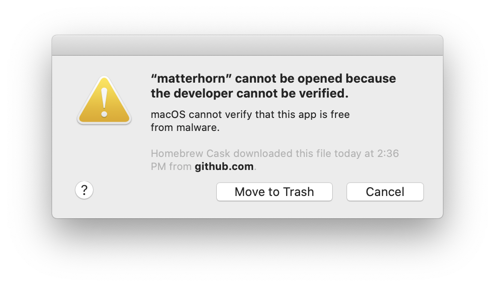

## How can I view configured networks in my terminal?

Let's assume you have multiple networks set up under `System Preferences > Networks`.

You might have "Work" which has a bunch of proxy configuration specified and "Home" which just disabled proxy configuration.

If you left the former "Work" network selected, then went to a place that can't access the proxy server, you wouldn't be able to access the internet and vice versa.

To make automating this a little bit easier, there's a command line tool called `scselect`

Here's an example of what it looks like in action:

```bash
> scselect
Defined sets include: (* == current set)
 * <guid> (Work)
   <guid> (Home)
```

In this example, we can see the `Work` network is selected.

Now we wanted to change to the Home network, you could do so manually in `System Preferences` or you can run `scselect` with the name of the network you want to change to like so:

```bash
> scselect Home
CurrentSet updated to <guid> (Home)
> scselect
Defined sets include: (* == current set)
   <guid> (Work)
 * <guid> (Home)
```

As you can see, the `Home` network is now selected.

I only recently discovered this tool so I haven't automated it yet but it's probably feasible to have a file with your working hours and then if it's within those hours, toggle on the `Work` network (and all of the proxy configuration that comes with it)

The reason you might want to use a schedule and not eg; WiFi name is that you might be working from home over a VPN for example.

## How can I run a Homebrew application being blocked by Gatekeeper?

This issue is particularly annoying and I only just discovered it today for the first time.

Here's an example of what it looks like

[](gatekeeper.png)

In order to install the application so that it bypasses Gatekeeper, you can rerun `brew cask install` like so:

```shell
> brew cask install --no-quarantine blah
> brew reinstall --no-quarantine blah
```

If you'd like to keep this flag enabled all the time, and honestly you might as well, you can also do the following:

```shell
> export HOMEBREW_CASK_OPTS="--no-quarantine"
> brew cask install blah
```

## How can I hide folders in my Home directory?

If you've ever seen those pesky default folders like `Public` and `Movies`, the good news is that you can get rid of them.

You can't, or more specifically, you shouldn't fully delete them as some applications may assume their existence but you can get close enough.

Let's say we want to hide `Public`, you can hide it from Finder like so:

```shell
chflags hidden ~/Public
```

The next time you navigate to your Home directory using Finder, you'll see that they've magically disappeared

If you want to hide multiple at once, you can provide a comma delimited list:

```shell
chflags hidden ~/{Downloads,Public}
```

If, for whatever reason, you wanted to block anyone or anything from accessing those folders as well, you could use `chmod` to do that:

```shell
chmod 000 ~/{Downloads,Public}
```

Personally, I don't bother with this step but you might have a use for it.

The one issue with the above is that you'll see those files appear in your Terminal and I don't know about you but that basically makes this whole exercise pointless.

There are ways to do it but I haven't looked into them myself.

## How can I see my route table?

For those of us who are subject to using corporate VPNs, all sorts of wackiness can occur such as `127.0.0.1` being routed first to another country before trying to resolve locally.

You can see both IPv4 and IPv6 routing entries by running `netstat -rn`. Personally, I like to just show IPv4 addresses.

Here's an example of my route table with WiFi (and ethernet) interfaces disabled:

```shell
> netstat -nr -f inet
Routing tables

Internet:
Destination        Gateway            Flags        Netif Expire
127                127.0.0.1          UCS            lo0
127.0.0.1          127.0.0.1          UH             lo0
111.0.0            link#1             UmCS           lo0
```

I've changed the last entry since I don't actually know if it's an internet work address.
