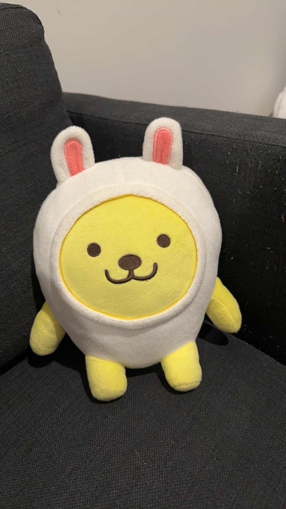

At present, I render images such that clicking on them takes you directly to the image but it'd be nice to be able to tap to view the image in fullscreen without the overhead of navigating away.

Click to expand into full screen viewer
